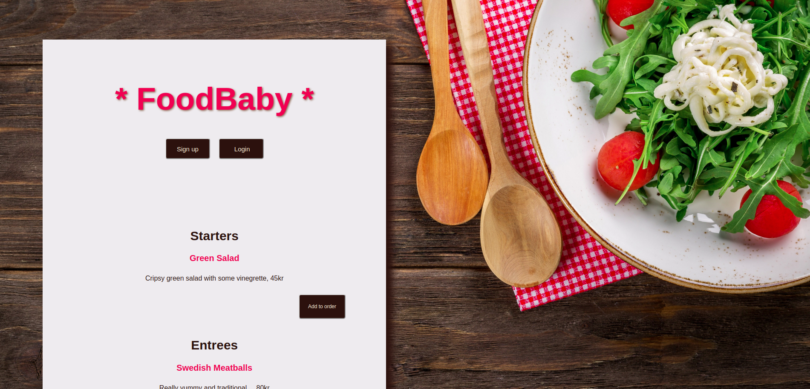
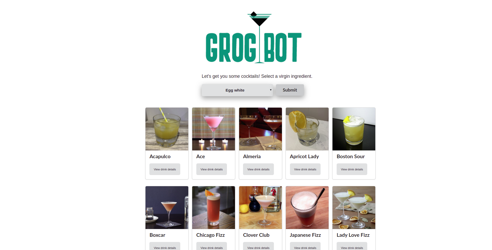
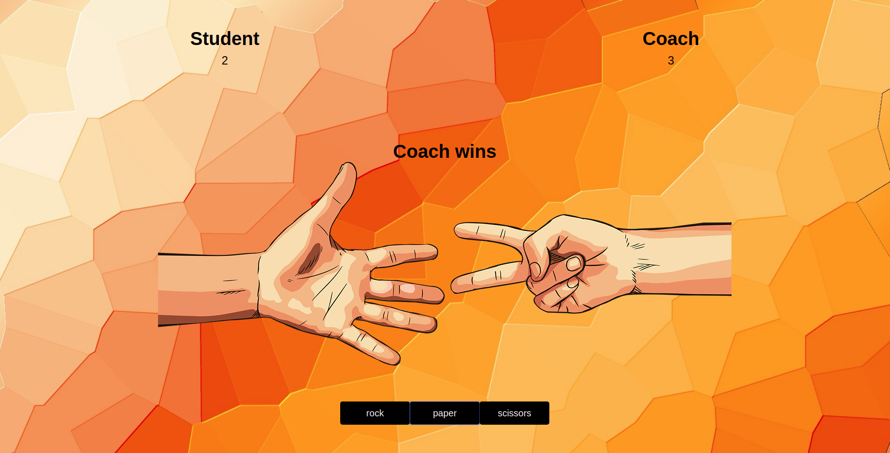
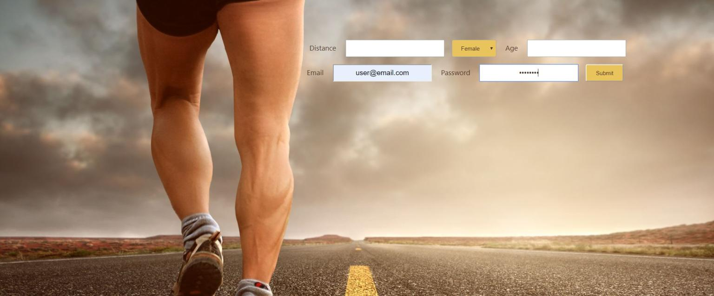
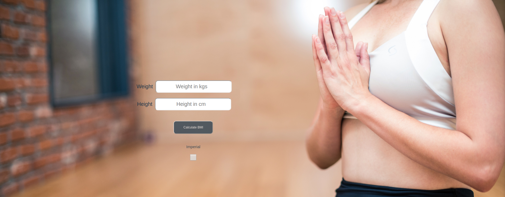
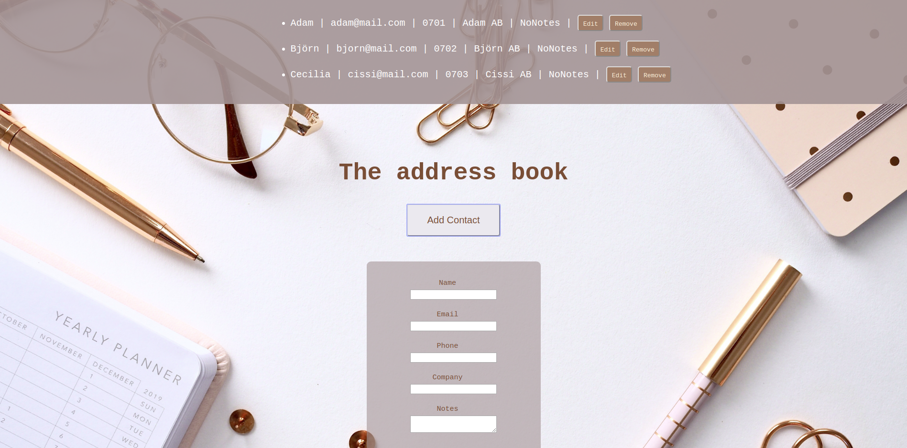

# I'm Karro 
#### A marketing professional turned front end developer looking for work out of Stockholm (Sweden) or remotely. I like to say that I build clean, beautiful user interfaces that speak to its visitors in the language of my clients and their visions for the brand.

## The Projects
Most of my projects are built using [Ruby on Rails](https://rubyonrails.org/) and [React](https://reactjs.org/). My projects where all created with the test driven development method where the two primary testing frameworks are [Cypress](https://www.cypress.io/) and [RSpec](https://rspec.info/).

# Some of the apps

## FoodBaby

Soon you'll be able to read a little about this project right here.

## GrogBot

Soon you'll be able to read a little about this project right here.

## Rock, Paper and Scissors

Soon you'll be able to read a little about this project right here.

## Cooper Tracker

Soon you'll be able to read a little about this project right here.

## BMI Calculator

Soon you'll be able to read a little about this project right here.

## Address Book

Soon you'll be able to read a little about this project right here.

# Other collections

Soon you'll be able to see a list of other places you can go to.

                                                          
# Name of Repo/assignment

**Week *X* of learning how to code.** A short paragraph about the assignment or objective for this challenge. If there is a website then publish the URL in this paragraph for easy access. For example: [View the BMI-calculator live through GitHub](https://kfrostare.github.io/BMI_repo/)

Add a printscreen of the launched website/app/other.
*More information below the image.*

### Assignment
**Make sure the user can:**
* Enter weight
* Enter height
* Press calculate- button
* View a message

### Programs practiced in this challenge
* **Coding**
: | JavaScript | Html | Css |
* **Testing**
: | Cypress | Yarn |  
* **Launching**
: | GitHub |
* **Other**
: | VSCode | Git |

## Build, test and launch
* Built with the source-code editor [Visual Studio Code](https://code.visualstudio.com/)
* Tested with [Cypress](https://www.cypress.io/); the Js End to End testing framework
* Launched using [GitHub](https://github.com/); the world's leading software development platform

## Authors
* **Karolina Frostare** has built this application
* **[Craft Academy](https://www.craftacademy.se/english/)** has created this challenge and provided the learning material needed to accept it

## Acknowledgments
* The image used was (royalty) free and provided by [Pixabay.com](https://pixabay.com/)
* This assignment was provided by [Craft Academy](https://www.craftacademy.se/english/)