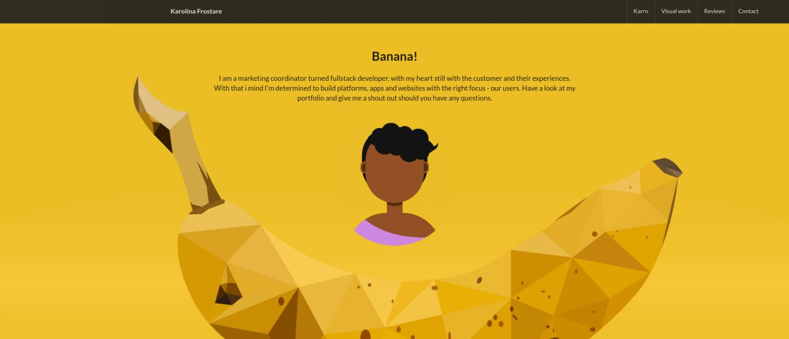

# I'm Karro 
#### A marketing professional turned front end developer looking for work out of [Stockholm](https://kartor.eniro.se/?c=59.399518,17.948624&z=14&q=%22kista%22;geo) (Sweden) or remotely. I like to say that I build clean, beautiful user interfaces that speak to its visitors in the language of my clients and their visions for the brand.

## The Projects
Most of my projects are built using [Ruby on Rails](https://rubyonrails.org/) and [React](https://reactjs.org/). My projects where all created with the test driven development method where the two primary testing frameworks are [Cypress](https://www.cypress.io/) and [RSpec](https://rspec.info/).

# Some of my Apps

**The FoodBaby App** is a food-for-pick-up application which lets logged in users choose food from a menu and add to a basket. Once ordered the kitchen gives you an estimated time for pick up. | **Coding experience at the time of deployment:** 6 weeks |   
*~ Check out the [repos](https://github.com/kfrostare-Foodbaby)* 
*~ Check out the [deployed site](https://slowfood-team1.netlify.com/), (log in as user@mail. com + password)*
  

**My Banana Portfolio** was my very first solo React- project where I could create something fun and goofy to portray my own personality. It shows some of my previous work, quotes former co workers and lists previous places of employment. | **Coding experience at the time of deployment:** 3 weeks |   
*~ Check out the [repos](https://github.com/kfrostare-Interviews/React_Portfolio)* 
*~ Check out the [deployed site](https://frostare.netlify.com/)*
  

**The GrogBot App** is a drink application that lets visitors choose a virgin ingredient which once submitted offers a list of drinks. The drinks show ingredients, instructions and type of glass. As the app is connected to a local Swedish liquor provider through an API you can also view a list of the liquors you can purchase in your local store, all Swedish brands of course.  
*~ Check out the [repos](https://github.com/kfrostare-Grogbot)*  
*~ Check out the [deployed site](https://grogbot.netlify.com/)*
  

**Rock, Paper, Scissors Interview** was a tech tech interview challenge where the applicant could pick any coding language and create the classic childrens game Rock, Paper or Scissors. This particular challenge was coded in Vanilla Javascript with logic and moving graphics. | **Coding experience at the time of deployment:** 5 weeks |  
*~ Check out the [repo](https://github.com/kfrostare-Interviews/RockPaperScissors_CraftAcademy)* 
*~ Check out the [deployed site](https://kfrostare-rpscraftacademy.netlify.com/)*
  

**The Cooper Tracker App** is a workout tracking application that will allow users to track their fitness using the Cooper Test. This is a software solution where users can calculate and record their data over time. The app also presents any historical data logged by the user. | **Coding experience at the time of deployment:** 4 weeks |  
*~ Check out the [repos](https://github.com/kfrostare-Coopertracker)* 
*~ Check out the [deployed site](https://kfrostare-cooperapp.netlify.com/)*
  

**The BMI Calculator** is a really light weight little app for anybody who would like to get an evaluation on their body mass index (BMI). They can enter height and weight in kilos in order to get it calculated. | **Coding experience at the time of deployment:** 2 weeks |   
*~ Check out the [repo](https://github.com/kfrostare-BMIcalculator)*  
*~ Check out the [deployed site](https://bmicalculatorror.netlify.com/)*
  

**The Address Book** is a simple little vanilla JavaScript app created mostly for fun during week 4 of learning how to code. You can add names of contacts that you can save locally on your machine and delete them as well as edit them. It's still a work in  progress as the accelerated training program I'm in didn't give time to work on many features. But please feel free to check it out.   
*~ Check out the [repo](https://github.com/kfrostare-Addressbook)* 
*~ Check out the [deployed site](https://rookieaddressbookbykarro.netlify.com/)*
  

# Other than that

**...my GitHub consists of a healthy mix including**:

*~ [Exercises](https://github.com/kfrostare-Exercises) in different languages and frameworks* 
*~ [Templates](https://github.com/kfrostare-Templates) for different occasions* 
*~ [Tech interviews](https://github.com/kfrostare-Interviews) that got to stay in my repository* 
*~ [Forked repos](https://github.com/kfrostare-Forked) in different shapes and sizes*